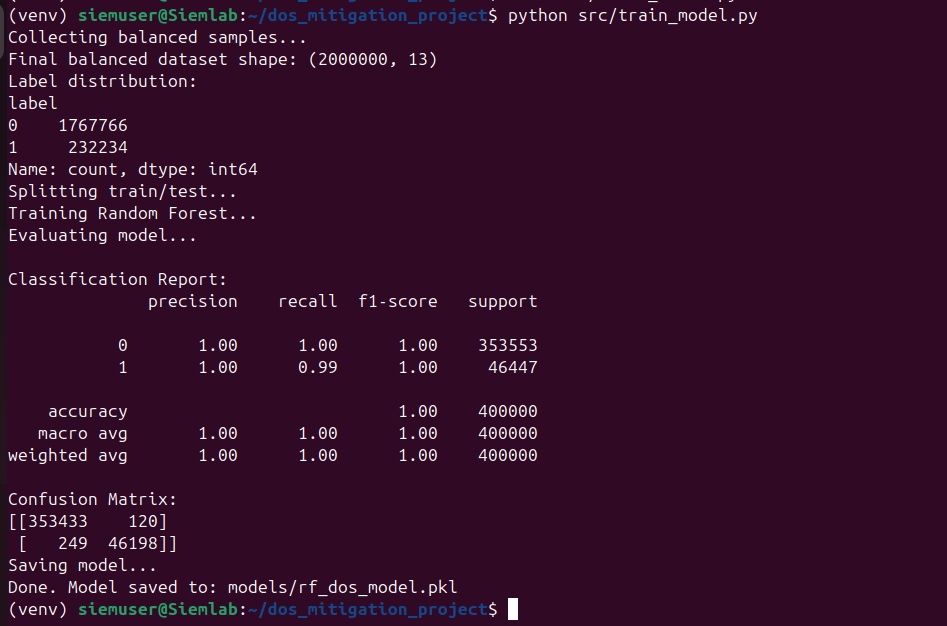
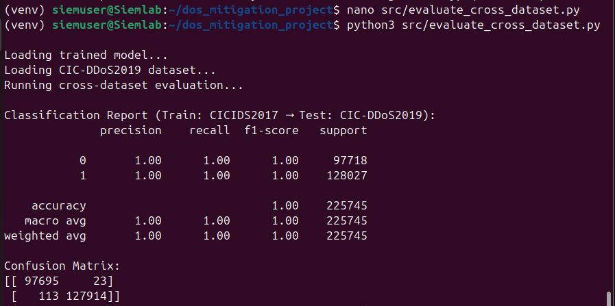
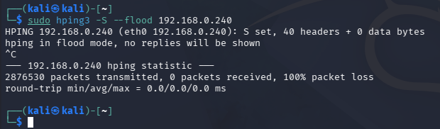
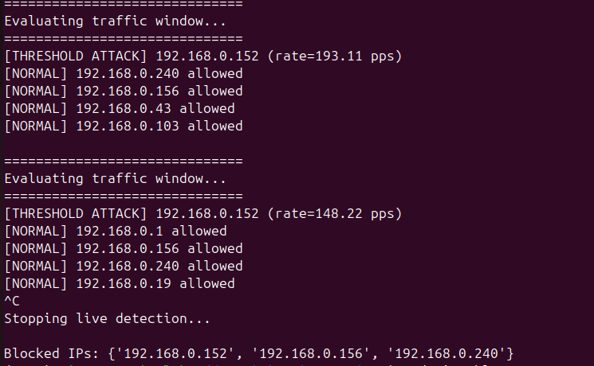
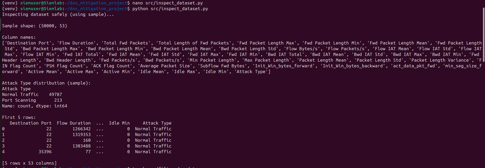
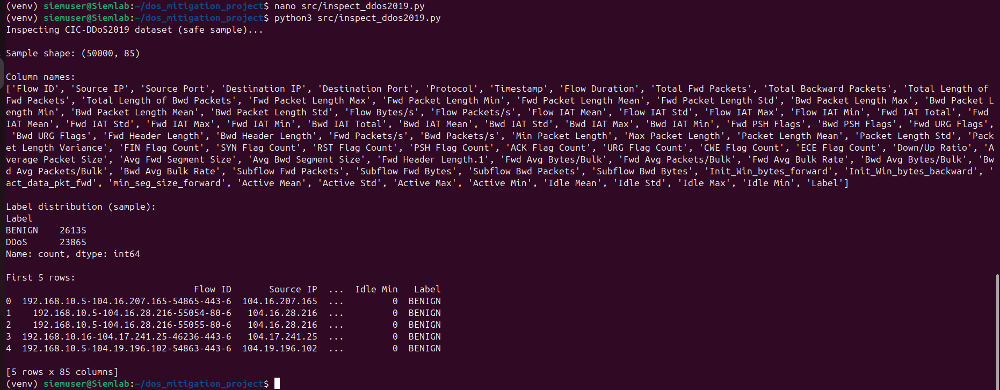

# AI-Based DoS Attack Mitigation System

## 🔍 Overview

This project implements a Machine Learning-based Intrusion Detection and Mitigation System to detect and prevent Denial of Service (DoS) attacks in real-time.

---

## 🚨 Problem

DoS attacks flood a network with excessive traffic, causing service disruption and system failure. Traditional systems fail to detect unknown attack patterns.

---

## 💡 Solution

This system uses:

* Machine Learning (Random Forest)
* Real-time packet capture (PyShark)
* Automated mitigation (iptables)

---

## ⚙️ Features

* Real-time DoS detection
* Automatic IP blocking
* Cross-dataset validation
* Live traffic monitoring

---

## 🧠 Model

* Random Forest Classifier
* High accuracy on CICIDS2017
* Cross-validated on CIC-DDoS2019

---

## 📊 Datasets

Due to large file sizes, datasets are not included.

Download from:

* CICIDS2017: https://www.unb.ca/cic/datasets/ids-2017.html
* CIC-DDoS2019: https://www.unb.ca/cic/datasets/ddos-2019.html

---

## 🛠️ Tech Stack

* Python
* Scikit-learn
* PyShark
* iptables
* Kali Linux

---

## 🚀 How to Run

```bash
pip install -r requirements.txt
python src/train_model.py
python src/live_detection_mitigation.py
```

---

## 📸 Results

### 📊 Model Training (CICIDS2017)


### 📊 Model Validation (CIC-DDoS2019)


### 🚨 Attack Detection


### 🛡️ Mitigation


### 📈 Additional Results


---

## 📌 Conclusion

The system successfully detects and mitigates DoS attacks in real-time using machine learning and network monitoring.

---

## ⚠️ Note

Dataset files are excluded due to GitHub size limitations.
